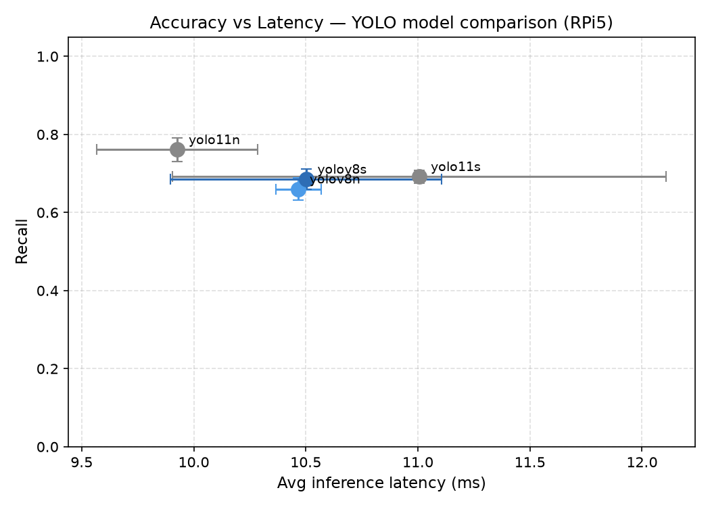
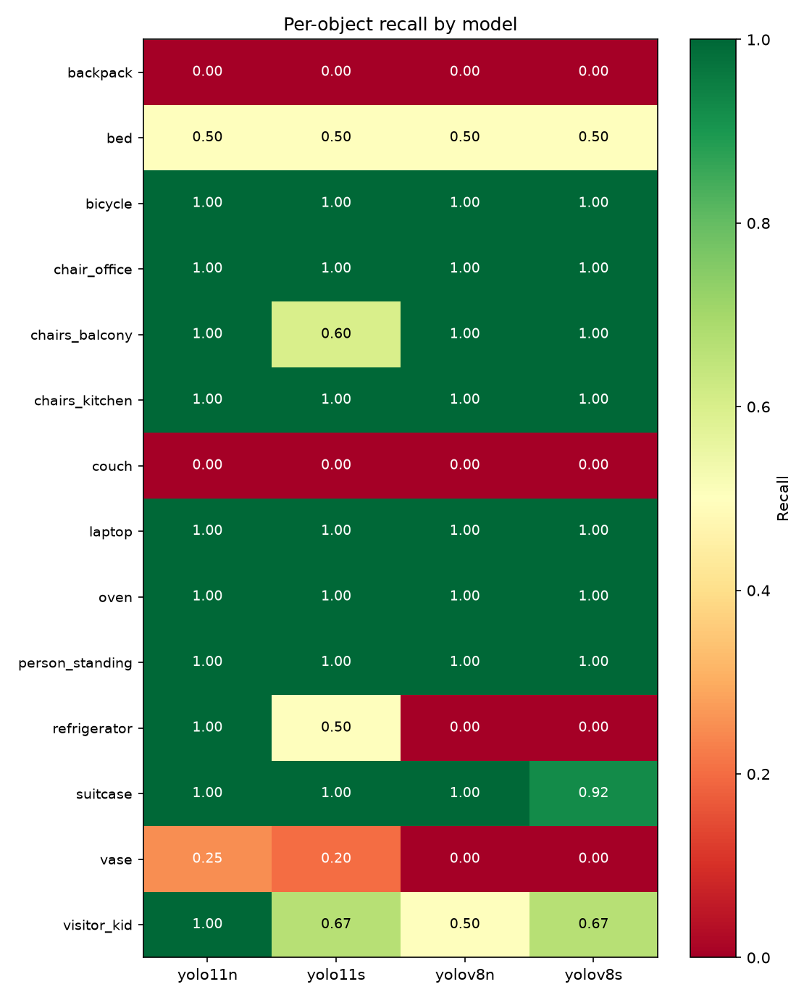
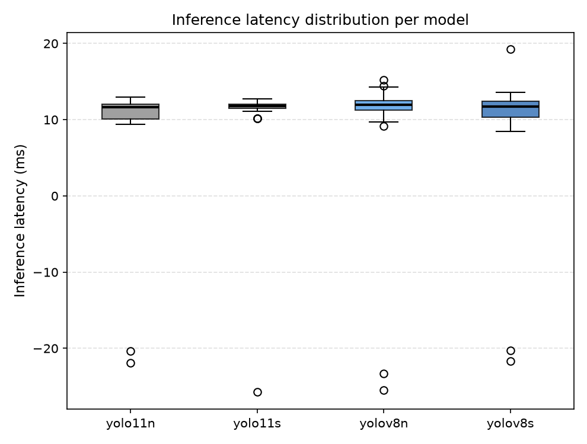
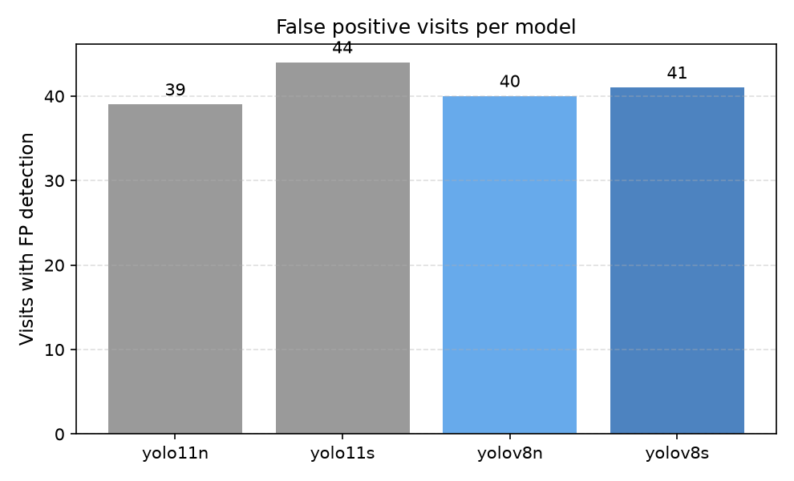

# VisionBot — Benchmark Results

Performance comparison of YOLO models for object detection on **Raspberry Pi 5** in a ROS 2 / Gazebo autonomous navigation scenario.

## Setup

- **World**: `small_house_benchmark.world` — residential house environment with 14 COCO objects
- **Route**: Scripted patrol covering all objects via Nav2 waypoint following
- **Camera**: 2D RGB only (no depth), 640×480
- **Hardware**: Raspberry Pi 5 (8GB RAM), inference via PyTorch (.pt models)
- **Ground truth**: Object positions from Gazebo (`ground_truth.yaml`), frustum-based visibility check

## Models

| Model | Parameters | Notes |
|---|---|---|
| yolo11n | ~2.6M | YOLOv11 nano |
| yolo11s | ~9.4M | YOLOv11 small |
| yolov8n | ~3.2M | YOLOv8 nano |
| yolov8s | ~11.2M | YOLOv8 small |

All models are COCO-pretrained (.pt format, FP32).

## Test 2 Results

### Summary

| Model | Recall | Precision | Avg Latency (ms) |
|---|---|---|---|
| **yolo11n** | **0.761** | **0.796** | **9.93** |
| yolo11s | 0.692 | 0.735 | 11.01 |
| yolov8s | 0.685 | 0.744 | 10.50 |
| yolov8n | 0.660 | 0.717 | 10.47 |

### Accuracy vs Latency



yolo11n dominates — highest recall and lowest latency. All other models cluster around 10.5ms with ~0.68 recall.

### Per-object Recall



**Reliably detected (all models):** bicycle, chair\_office, chairs\_kitchen, laptop, oven, person\_standing

**Problematic objects:**
- `backpack`, `couch` — 0.00 across all models (visibility issue, not model limitation)
- `vase` — max 0.25 (yolo11n); 0.00 for YOLOv8 variants
- `refrigerator` — detected only by yolo11n (1.00); 0.00 for yolov8n/s

### Latency Distribution



### False Positives



All models produce 39–44 FP visits per run (robot passing non-target objects that match COCO classes). yolo11n has the fewest (39).

## Reproducing a Benchmark Run

```bash
ros2 launch visionbot_startup benchmark.launch.py \
  model_path:=/path/to/yolo11n.pt \
  model_name:=yolo11n \
  output_dir:=/tmp/visionbot_results
```

Results are saved as CSV to `output_dir`.
