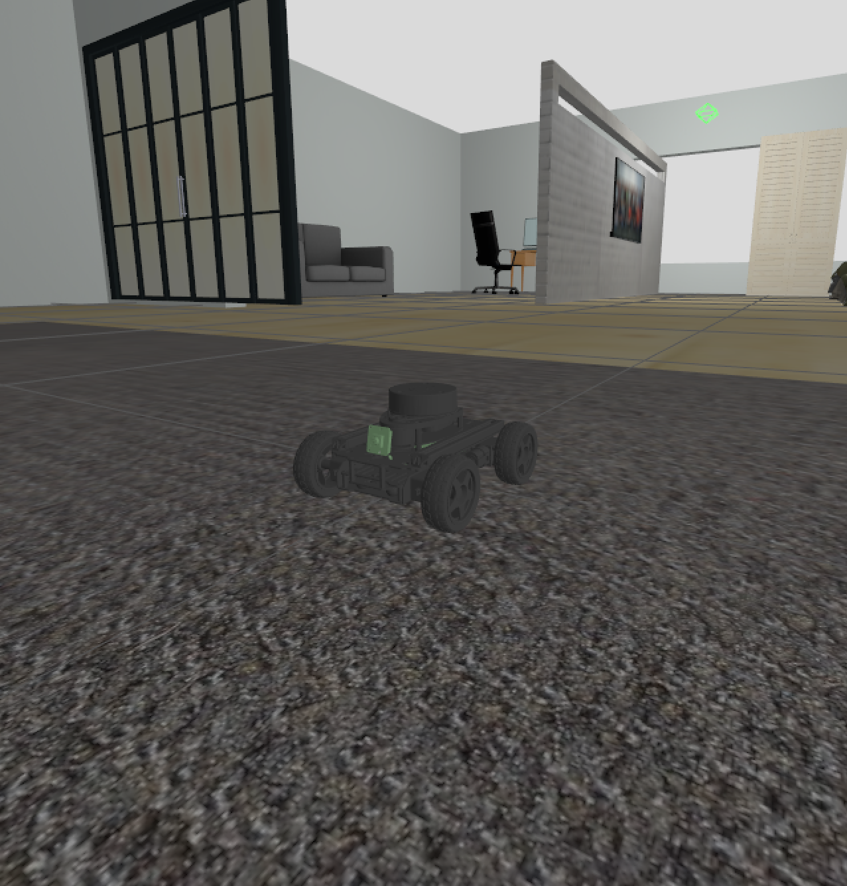

# VisionBot

**VisionBot** is a mobile robot platform developed as part of a Master's thesis project. The research goal is to analyze and compare the performance of YOLO-based object detection models running on a Raspberry Pi 5 in a realistic autonomous navigation scenario using ROS 2 and Gazebo.



## Requirements

- Ubuntu 24.04
- ROS 2 Jazzy
- Gazebo Harmonic

```bash
source /opt/ros/jazzy/setup.bash
colcon build --symlink-install
source install/setup.bash
```

## Running the Simulation

```bash
# Full simulation with pre-built map (navigation mode)
ros2 launch visionbot_startup simulation.launch.py

# With SLAM (mapping mode)
ros2 launch visionbot_startup simulation.launch.py use_slam:=true
```

## Benchmark

See [BENCHMARK.md](BENCHMARK.md) for methodology, model comparison results, and how to reproduce the benchmark runs.

## Repository Structure

```
src/
├── visionbot_description/   # Robot URDF, Gazebo simulation, sensors
├── visionbot_control/       # Safety stop, heartbeat, twist_mux
├── visionbot_localization/  # EKF (local) + AMCL (global localization)
├── visionbot_navigation/    # Nav2 stack + SLAM Toolbox
├── visionbot_planning/      # Custom A* planner + Pure Pursuit controller
├── visionbot_perception/    # YOLO detector node (swappable model via param)
├── visionbot_benchmark/     # Benchmark runner + metrics logger
└── visionbot_startup/       # Main bringup launch files
```

## Author

Pavle Gasic — Master's Thesis, 2025
